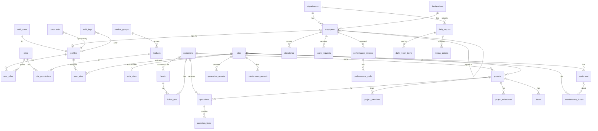

# Diwakar Solar Management Suite — Architecture & Phase 1 Plan

**Status:** Draft for approval · **Date:** 22 Sep 2026 · **Scope:** Architecture only. No code has been written.

One website, one login, one database, one sidebar, one user/role/site-access system and one dashboard. It replaces HR/PMS, Daily Review CRM, Project CRM and O&M CRM with native modules. There are **no** links, iframes, launchers or redirects to the old applications.

> **Reference material I actually had:** the Daily Review CRM source (this folder: `public/index.html`, `netlify/functions/*`, `.crm-local-db.json`). Its data model is reflected in §3.8. **I did not receive the screenshots**, and I do not have the source for the other three apps. Their modules below follow your specification. See §13, open items.

---

## 0. Changes to the specification that need your approval

Each change removes a duplication that would otherwise cause bugs later. Nothing here drops a feature.

| # | Specification says | Proposed | Reason |
|---|---|---|---|
| D1 | `sites` (admin) **and** `solar_sites` (O&M) | One `sites` table is the site-access anchor. `solar_sites` becomes a 1:1 technical extension (`site_id` PK/FK) | Two site tables would mean two sources of truth for site access. |
| D2 | `tasks` (HR) **and** `project_tasks` | One `tasks` table with `module`, `project_id`, `site_id`, `lead_id`, … links. Project pages filter it by `project_id` | The specification also asks for "centralized task management" across CRM/Projects/O&M/HR/Daily Review. |
| D3 | `project_documents` + attachments in several modules | One `documents` table (`entity_type`, `entity_id`) plus private Storage buckets | Gives one upload component, one access rule and one audit trail. |
| D4 | `profiles` and `employees` hold overlapping fields | `employees` is the HR master record. `profiles` is the login identity with `employee_id` FK (nullable). Sensitive HR data goes in `employee_private` | Not every employee needs a login (for example, some technicians), and HR-sensitive data must not leak through general access. |
| D5 | Permission = module × action | Module × action **× data scope** (`own` / `team` / `all`) | Needed for "Technician: only assigned tasks" and "Project Manager: only permitted projects" without hard-coding role names. |
| D6 | Delete | Soft delete (`deleted_at`) for business records. Hard delete only by Super Admin via RPC | Keeps the audit history and allows recovery. |
| **D8** *(23 Sep 2026)* | Phase order 3 → 4 → 5 → 6 → 7 | Built **4 (O&M) → 5 (HR) → 6 (Daily Review) → 7 (Reports)**; Phase 3 (Projects & milestones) deferred | Your instruction. `tasks` shipped with Phase 5 so every module has a task list. |
| **D9** *(24 Sep 2026)* | O&M CRM = sites, generation, tickets, maintenance | Added four modules so every tab of the live O&M CRM has a native home: `om.operations` (daily site register), `om.performance` (technician scoring), `om.team` (site contact register), `om.analytics` (site trend, shutdown, portfolio). The register's 28 check points and the five scoring criteria are rows, not code. | The legacy tool is a dashboard plus four Google Forms; replacing it means replacing the forms too. Deriving the 80 automatic marks from data the suite already holds removes the sheet entirely. |
| **D10** *(24 Sep 2026)* | PMS scoring was an open gap; Phase 3 was deferred | Built both: `hr.worklog` + `hr.scorecard` reproduce the PMS sheet's own 60/20/10/10 arithmetic from data the suite records, and Phase 3 ships as `projects.*` with a two-step vendor-bill approval. The plan, approvals, materials, bills and client money are modules without menu entries — they appear as tabs inside a project. | The four legacy apps are only fully replaced once the PMS score sheet and the Project CRM exist natively. Keeping the sub-modules out of the menu keeps the sidebar readable while leaving permissions, scope and audit intact. |
| **D11** *(24 Sep 2026)* | The legacy history was to be a one-time SQL load | Shipped it as a **feature** instead: `admin.import` with `import_om_generation`, `import_daily_reports` and `import_work_logs`, each permission-checked, site-scoped, audited, idempotent and with a dry run. | A one-off script runs once on one machine. An import page can be re-run after a correction, on production, by the people who own the data — and the same code path is what the tests exercise. |
| **D7** *(added 23 Sep 2026, on your instruction)* | CRM **Customers** module | **Tenders** module: government bid lifecycle, EMD/tender-fee tracking, deadlines, bid result and award. Quotations link to a tender or a lead; the "client" is the authority named on the quotation | The company sells by bidding for government tenders, not by managing a customer base. |

---

## 1. System architecture

```
┌──────────────────────────── Browser (Netlify CDN) ────────────────────────────┐
│ React 18 + Vite + TS + Tailwind + shadcn/ui + React Router                     │
│  AuthProvider ─► AccessProvider (roles, permissions, sites, enabled modules)   │
│  AppShell (dynamic Sidebar/Topbar) ─► Route guards ─► Feature modules          │
│  TanStack Query (cache) ─► supabase-js (anon key + user JWT only)              │
└───────────────┬───────────────────────────────┬───────────────────────────────┘
                │ PostgREST / RPC (JWT)         │ HTTPS (JWT)
┌───────────────▼───────────────────┐  ┌────────▼──────────────────────────────┐
│ Supabase Postgres                 │  │ Supabase Edge Functions (Deno)        │
│  • public schema: business tables │  │  • admin-users: invite/create/reset/  │
│  • app schema: authz functions    │  │    ban/unban (service role, server-   │
│    has_perm / perm_scope /        │  │    side permission check)             │
│    my_site_ids / is_super_admin   │  │  • export (Phase 7: audited export)   │
│  • RLS on every table             │  │  • ingest-generation (Phase 4+:       │
│  • guard triggers (approve/assign)│  │    SCADA/API/Excel, per-source key)   │
│  • audit triggers → audit_logs    │  └───────────────────────────────────────┘
│  • RPCs for dashboard & workflows │  ┌───────────────────────────────────────┐
└───────────────────────────────────┘  │ Supabase Auth (email+password, invite │
┌───────────────────────────────────┐  │ only, optional TOTP MFA for admins)   │
│ Supabase Storage (private buckets,│  └───────────────────────────────────────┘
│ RLS via documents table)          │
└───────────────────────────────────┘
```

**Principles**

1. **The database is the security boundary.** Every table has RLS enabled. The UI only reflects what the database already allows.
2. **Permissions are data, not code.** Role names are never checked in application code or policies. Only `module_key + action` is checked. The single exception is the `is_system` Super Admin role.
3. **The service-role key never reaches the browser or Netlify.** It exists only inside Edge Functions.
4. **Use one pattern everywhere.** Each module follows the same pattern: table, standard policies, manifest, pages. Adding a module does not touch the authorization core.

**Libraries:** TanStack Query, TanStack Table, react-hook-form + zod, Recharts, date-fns (IST), lucide-react, SheetJS/exceljs for export. Tooling: Supabase CLI (migrations, type generation, `supabase test db` with pgTAP), Vitest, Playwright.

---

## 2. ER diagram



---

## 3. Database schema

Conventions for every business table, abbreviated below as `[std]`:

```sql
id          uuid primary key default gen_random_uuid(),
created_at  timestamptz not null default now(),
updated_at  timestamptz not null default now(),   -- trigger set_updated_at()
created_by  uuid references profiles(id) default auth.uid(),
updated_by  uuid references profiles(id),
deleted_at  timestamptz                            -- soft delete (D6)
```

Other conventions: human codes (`LD-000123`, `QT-2026-0042`, `TK-…`) come from per-table sequences plus a trigger. Money is `numeric(14,2)` in INR. Energy is `numeric(14,3)` in kWh. Business dates are `date`, events are `timestamptz`, and display uses Asia/Kolkata. Enums are Postgres enums for fixed workflows. Lookup tables are used where admins need to edit values.

### 3.1 Enums

```sql
create type perm_action as enum ('view','create','edit','delete','export','approve','assign');
create type perm_scope  as enum ('own','team','all');           -- ordered: own < team < all
create type user_status as enum ('invited','active','inactive');
create type record_status as enum ('active','inactive');
create type lead_status as enum ('new','contacted','interested','quoted','converted','lost');
create type quotation_status as enum ('draft','sent','under_discussion','approved','rejected','expired');
create type followup_status as enum ('scheduled','done','missed','cancelled');
create type project_status as enum ('planning','active','on_hold','completed','cancelled');
create type ticket_status as enum ('open','assigned','in_progress','resolved','closed');
create type priority as enum ('low','medium','high','critical');
create type task_status as enum ('todo','in_progress','blocked','done','cancelled');
create type task_module as enum ('crm','projects','om','hr','daily_review','general');
create type attendance_status as enum ('present','absent','half_day','leave','holiday','week_off');
create type leave_status as enum ('pending','approved','rejected','cancelled');
create type review_status as enum ('draft','self_review','manager_review','completed');
create type daily_report_status as enum ('draft','submitted','reviewed','returned');
create type daily_health as enum ('on_track','needs_attention','critical');
```

### 3.2 Identity, organization and access (Phase 1)

```sql
departments   ([std], name text unique not null, code text unique, head_employee_id uuid,
               color text, status record_status default 'active')
designations  ([std], name text unique not null, department_id uuid references departments)

employees     ([std], employee_code text unique not null,          -- "Employee ID"
               full_name text not null, email citext, phone text,
               department_id uuid references departments, designation_id uuid references designations,
               reporting_manager_id uuid references employees, joining_date date,
               status record_status default 'active', photo_path text)
employee_private (employee_id uuid pk references employees on delete cascade,
               dob date, address text, emergency_contact jsonb, pan text, aadhaar_last4 text,
               bank_account jsonb, salary jsonb, updated_at timestamptz)   -- separate module key (D4)

profiles      (id uuid pk references auth.users on delete cascade,
               email citext unique not null, full_name text not null, phone text,
               employee_id uuid unique references employees,
               avatar_path text, status user_status not null default 'invited',
               all_sites boolean not null default false,          -- org-wide site access
               last_login_at timestamptz, created_at, updated_at)

module_groups (id uuid pk, key text unique, label text, icon text, sort_order int)
modules       (id uuid pk, group_id uuid references module_groups, key text unique not null,  -- 'crm.leads'
               label text, route text, icon text, sort_order int,
               supported_actions perm_action[] not null,          -- drives matrix "–" cells
               supports_scope boolean default true, is_site_scoped boolean default false,
               is_enabled boolean default true, phase int)

roles         ([std], key text unique not null, name text not null, description text,
               is_system boolean default false,                   -- only super_admin
               is_active boolean default true)
role_permissions (role_id uuid references roles on delete cascade,
               module_id uuid references modules on delete cascade,
               action perm_action not null, scope perm_scope not null default 'all',
               primary key (role_id, module_id, action))
user_roles    (user_id uuid references profiles on delete cascade,
               role_id uuid references roles on delete restrict,
               assigned_by uuid, assigned_at timestamptz default now(),
               primary key (user_id, role_id))

sites         ([std], code text unique, name text unique not null, location text,
               district text, state text, latitude numeric, longitude numeric,
               capacity_kwp numeric(12,3) default 0, status record_status default 'active')
user_sites    (user_id uuid references profiles on delete cascade,
               site_id uuid references sites on delete cascade,
               assigned_by uuid, assigned_at timestamptz default now(),
               primary key (user_id, site_id))

app_settings  (key text pk, value jsonb, updated_by uuid, updated_at timestamptz)

audit_logs    (id bigint generated always as identity pk, occurred_at timestamptz default now(),
               actor_id uuid, actor_email text, action text not null,       -- login, logout, create,
               module_key text, entity_table text, entity_id text,          -- update, delete, approve,
               summary text, changes jsonb, ip inet, user_agent text)       -- assign, role.*, perm.*, site.*
               -- index (occurred_at desc), (actor_id), (module_key), (action), (entity_table, entity_id)

documents     ([std], entity_type text not null, entity_id uuid not null,   -- D3
               bucket text not null, storage_path text unique not null,
               file_name text, mime_type text, size_bytes bigint, category text,
               site_id uuid references sites)                               -- denormalized for RLS
```

### 3.3 CRM (Phase 2)

```sql
customers     ([std], customer_code text unique, name text not null, company text,
               contact_person text, phone text, email citext, gstin text,
               billing_address text, site_address text, city text, state text,
               owner_id uuid references profiles, converted_from_lead_id uuid,
               status record_status default 'active')
leads         ([std], lead_code text unique, company text, contact_person text not null,
               phone text, email citext, location text, source text,       -- source = lookup (editable)
               status lead_status default 'new', lead_value numeric(14,2) default 0,
               capacity_kwp numeric(12,3), assigned_to uuid references profiles,
               next_follow_up date, notes text, lost_reason text,
               customer_id uuid references customers)                        -- set on conversion
follow_ups    ([std], lead_id uuid references leads, customer_id uuid references customers,
               check (lead_id is not null or customer_id is not null),
               follow_up_at timestamptz not null, type text,                 -- call/visit/email/whatsapp/meeting
               assigned_to uuid references profiles, notes text, outcome text,
               status followup_status default 'scheduled', next_follow_up_at timestamptz)
quotations    ([std], quotation_no text unique, customer_id uuid references customers,
               lead_id uuid references leads, project_id uuid references projects,
               quote_date date default current_date, valid_until date,
               status quotation_status default 'draft',
               subtotal numeric(14,2) default 0, tax_total numeric(14,2) default 0,
               grand_total numeric(14,2) default 0,                          -- trigger-computed
               terms text, approved_by uuid references profiles, approved_at timestamptz,
               revision int default 1, parent_quotation_id uuid references quotations)
quotation_items (id uuid pk, quotation_id uuid references quotations on delete cascade,
               line_no int, description text not null, hsn_sac text, unit text,
               quantity numeric(14,3) not null, rate numeric(14,2) not null,
               tax_rate numeric(5,2) default 0,                              -- GST %
               amount numeric(14,2) generated always as (quantity*rate) stored)
```

### 3.4 Projects (Phase 3)

```sql
projects      ([std], project_code text unique, name text not null,
               customer_id uuid references customers, site_id uuid references sites,
               project_manager_id uuid references profiles,
               capacity_kwp numeric(12,3), contract_value numeric(14,2) default 0,
               start_date date, target_date date, completed_date date,
               status project_status default 'planning',
               progress_pct numeric(5,2) default 0,                           -- from milestones weights
               description text)
project_members (project_id uuid references projects on delete cascade,
               user_id uuid references profiles, project_role text, primary key (project_id,user_id))
project_milestones ([std], project_id uuid references projects on delete cascade,
               name text, weight numeric(5,2) default 0, due_date date,
               completed_at timestamptz, status task_status default 'todo', sort_order int)
```

### 3.5 Central tasks (used by every module; D2)

```sql
tasks         ([std], task_code text unique, title text not null, description text,
               module task_module not null default 'general',
               assigned_to uuid references profiles, due_date date,
               priority priority default 'medium', status task_status default 'todo',
               project_id uuid references projects, milestone_id uuid references project_milestones,
               site_id uuid references sites, lead_id uuid references leads,
               customer_id uuid references customers, ticket_id uuid references maintenance_tickets,
               daily_report_id uuid references daily_reports, completed_at timestamptz)
```

### 3.6 O&M / Solar (Phase 4)

```sql
solar_sites   (site_id uuid pk references sites on delete cascade,             -- D1
               project_id uuid references projects, capacity_dc_kwp numeric(12,3),
               capacity_ac_kw numeric(12,3), commissioning_date date,
               grid_connection text, discom text, inverter_count int,
               monitoring_source text,                                        -- manual / api / scada / excel
               expected_yield_kwh_per_kwp numeric(8,3),                       -- for expected generation
               om_lead_id uuid references profiles)
equipment     ([std], site_id uuid references sites not null, type text,       -- inverter/module/transformer/...
               make text, model text, serial_no text, capacity text,
               installed_on date, warranty_until date, status record_status default 'active')
generation_records ([std], site_id uuid references sites not null, gen_date date not null,
               generation_kwh numeric(14,3) not null default 0,
               expected_kwh numeric(14,3), irradiation_kwh_m2 numeric(8,3),
               grid_outage_hrs numeric(6,2) default 0, plant_outage_hrs numeric(6,2) default 0,
               source text default 'manual', remarks text,
               unique (site_id, gen_date))
maintenance_tickets ([std], ticket_no text unique, site_id uuid references sites not null,
               equipment_id uuid references equipment, issue text not null,
               category text, priority priority default 'medium',
               reported_by uuid references profiles, assigned_to uuid references profiles,
               status ticket_status default 'open', started_at timestamptz,
               resolved_at timestamptz, closed_at timestamptz,
               generation_loss_kwh numeric(14,3), root_cause text, remarks text)
maintenance_records ([std], site_id uuid references sites not null,
               equipment_id uuid references equipment, ticket_id uuid references maintenance_tickets,
               type text,                                                     -- preventive / corrective / cleaning
               scheduled_date date, done_date date, performed_by uuid references profiles,
               checklist jsonb, findings text, status task_status default 'todo')
-- Phase 4+ integration (no fabricated data):
data_sources  (id, site_id, kind text, config jsonb, api_key_hash text, is_active, last_sync_at)
ingestion_runs(id, source_id, started_at, finished_at, rows_in, rows_rejected, error text)
```

### 3.7 HR / PMS (Phase 5)

```sql
attendance    ([std], employee_id uuid references employees not null, att_date date not null,
               status attendance_status not null, check_in timestamptz, check_out timestamptz,
               site_id uuid references sites, remarks text, unique (employee_id, att_date))
leave_requests ([std], employee_id uuid references employees not null, leave_type text,
               from_date date, to_date date, days numeric(4,1), reason text,
               status leave_status default 'pending', approved_by uuid, approved_at timestamptz)
performance_reviews ([std], employee_id uuid references employees not null,
               period_label text, period_start date, period_end date,
               reviewer_id uuid references profiles, overall_rating numeric(3,1),
               manager_comments text, employee_comments text, status review_status default 'draft')
performance_goals (id uuid pk, review_id uuid references performance_reviews on delete cascade,
               title text, kpi text, target text, actual text, weight numeric(5,2),
               self_rating numeric(3,1), manager_rating numeric(3,1), comments text)
```

### 3.8 Daily Review (Phase 6), based on the existing Daily Review CRM

The current app stores department reports per date (`status` On track / Needs attention / Critical, `reporter`, metric label/value pairs, highlights, blockers, remarks, CCM remarks, Founder remarks). It also stores a company-wide **headline** KPI row per date and a daily note. It shows a today-vs-previous-day comparison, a monthly summary, and Excel/PDF export.

```sql
daily_reports ([std], report_date date not null, report_type text default 'department', -- or 'individual'
               department_id uuid references departments, employee_id uuid references employees,
               reporter_id uuid references profiles, site_id uuid references sites,
               project_id uuid references projects, health daily_health default 'on_track',
               work_completed text,            -- legacy "highlights"
               issues text,                    -- legacy "blockers"
               next_day_plan text, remarks text,
               status daily_report_status default 'draft', submitted_at timestamptz)
               -- unique (department_id, report_date) where report_type='department' and deleted_at is null
daily_report_items (id uuid pk, report_id uuid references daily_reports on delete cascade,
               sort_order int, label text not null, value text not null)          -- legacy "metrics"
review_actions ([std], report_id uuid references daily_reports on delete cascade,
               action text not null,          -- 'ccm_remark' | 'founder_remark' | 'reviewed' | 'returned'
               comment text, reviewer_id uuid references profiles)
daily_headlines ([std], headline_date date unique, metrics jsonb)                     -- company KPIs
daily_notes   ([std], note_date date unique, body text)
```

### 3.9 Indexes (pattern)

Every FK column gets an index. Also: `(site_id, gen_date)`, `(site_id, status)` on tickets, `(assigned_to, status)` on leads/tasks/tickets/follow_ups, `(status)` on leads/projects/quotations, `(report_date)`, `(occurred_at desc)` on audit, trigram GIN on `leads(company, contact_person)` and `customers(name)` for search, and partial indexes `where deleted_at is null`.

---

## 4. Permission / RBAC model

**Grant = (role, module, action, scope).** The effective permission is the **union** over all of a user's active roles. For scope, the widest wins (`all` > `team` > `own`).

**Scope semantics** (each table declares its "owner" columns):

- `own`: records where I am `created_by`, `assigned_to`, `reporter`, a project member, or the record is my own employee record.
- `team`: `own`, plus records owned by employees who report to me (recursive `reporting_manager_id`).
- `all`: every record, **still limited by site access** for site-scoped modules.

**Module catalogue** (seeded in `modules`, editable by Super Admin: label, order, enabled):

| Group | Module key | Actions supported |
|---|---|---|
| Dashboard | `dashboard` | view |
| CRM | `crm.leads` | view create edit delete export assign |
| | `crm.customers` | view create edit delete export |
| | `crm.quotations` | view create edit delete export approve |
| | `crm.followups` | view create edit delete export assign |
| Operations | `projects.projects` | view create edit delete export assign approve |
| | `projects.milestones` | view create edit delete |
| | `om.sites` (Solar Sites) · `om.monitor` · `om.generation` | view create edit delete export (monitor: view export) |
| | `om.maintenance` · `om.tickets` · `om.equipment` | view create edit delete export assign (+approve for closing tickets) |
| HR & Performance | `hr.employees` · `hr.employees_private` | view create edit delete export |
| | `hr.attendance` · `hr.leave` · `hr.performance` | view create edit delete export approve |
| | `hr.org` (departments/designations) | view create edit delete |
| | `tasks` (Task Log) | view create edit delete export assign |
| Daily Review | `daily.reports` | view create edit delete export approve |
| | `daily.review` (CCM/Founder remarks, Management Review) · `daily.summary` | view create edit approve / view export |
| Analytics | `reports.crm` · `reports.projects` · `reports.om` · `reports.generation` · `reports.hr` · `reports.daily` | view export |
| Administration | `admin.users` · `admin.roles` · `admin.modules` · `admin.sites` · `admin.audit` · `admin.settings` | view create edit delete export assign |

**Semantics of the less obvious actions**

- **APPROVE** is enforced by `BEFORE UPDATE` triggers. For example, setting `quotations.status` to `approved`/`rejected`, `leave_requests.status` to `approved`, closing a ticket, or marking a daily report `reviewed` requires `has_perm(module,'approve')`. `approved_by` is also stamped server-side.
- **ASSIGN** means changing `assigned_to` / `project_manager_id` / `user_sites` / `user_roles` requires `assign`. The same trigger pattern enforces it.
- **EXPORT:** exporting data a user can already view cannot be fully prevented (they could copy it from the screen). Phase 1 hides the button and logs every export to the audit log. Phase 7 moves exports into an Edge Function that re-checks `export`, audits and rate-limits.
- **DELETE** maps to soft delete. The trigger requires `delete` when `deleted_at` goes from null to non-null.

**Default role matrix (seed; fully editable afterwards)**

| Role | Summary |
|---|---|
| Super Admin (`is_system`) | Implicit everything. Bypasses checks via `is_super_admin()`. Cannot be deleted or edited down. |
| Admin | Everything except `admin.roles` edit on the system role and `hr.employees_private`. All sites. |
| Management | View + export on all business modules, approve on quotations/projects/daily reviews, all reports. All sites. |
| Sales Executive | CRM leads/follow-ups/customers view·create·edit (scope `own`), quotations create·edit (own), reports.crm view. |
| Project Manager | Projects/milestones/tasks full (scope `own` = projects they manage or belong to), customers view, docs. |
| HR Admin | All `hr.*` including private, `hr.org`, reports.hr, `admin.users` view. |
| O&M Manager | All `om.*` (scope `all` within assigned sites), tasks assign, reports.om/generation. |
| Technician | `om.tickets` view·edit (own), `om.maintenance` view·edit (own), `tasks` view·edit (own), `om.generation` create (assigned sites), daily.reports create (own). |

**Safeguards (enforced in the database)**

- The `super_admin` role cannot be deleted, renamed, deactivated or have `role_permissions` changed.
- The last active Super Admin cannot be removed or deactivated.
- A user cannot grant themselves roles or sites. Only users with `admin.roles`/`admin.users` `assign` can, and only Super Admin can grant `super_admin`.

---

## 5. Site-access model

- `user_sites` lists a user's sites. `profiles.all_sites = true` (or Super Admin) means every site, including sites added later.
- A module marked `is_site_scoped` (O&M, generation, tickets, maintenance, equipment, solar sites, site-linked documents, attendance with site) filters **every** read and write by `site_id = any(app.my_site_ids())`.
- Projects: a project with a `site_id` is visible only if the site is accessible **and** the permission/scope allows it. Projects without a site use permission/scope only.
- Dashboard, reports and aggregates run as the calling user (`security invoker`), so a user with 5 sites gets totals over exactly those 5.
- Deactivating a site (`status='inactive'`) keeps its history visible and hides it from "new record" pickers.
- Site assignment changes are written to the audit log (`site.assigned` / `site.unassigned`).

---

## 6. RLS strategy

**Authorization functions** (schema `app`, `security definer`, `stable`, `set search_path = ''`, not exposed through the API):

```sql
app.is_active_user()   -- profiles.status = 'active' for auth.uid()
app.is_super_admin()   -- active + holds the is_system role
app.has_perm(module_key text, action perm_action) returns boolean
app.perm_scope(module_key text, action perm_action) returns perm_scope   -- widest; null if none
app.my_site_ids() returns uuid[]                                          -- all sites if super/all_sites
app.my_team_ids() returns uuid[]                                          -- me + recursive reports (profiles)
app.in_scope(module_key, action, owner_ids uuid[]) returns boolean        -- all / team / own check
```

**Standard policy set** (generated per table by `app.apply_standard_policies(table, module_key, site_col, owner_cols[])`, so future modules reuse it):

```sql
-- SELECT
using ( deleted_at is null
        and (select app.has_perm('om.tickets','view'))
        and site_id = any ((select app.my_site_ids()))
        and app.in_scope('om.tickets','view', array[created_by, assigned_to, reported_by]) )
-- INSERT
with check ( (select app.has_perm('om.tickets','create'))
             and site_id = any ((select app.my_site_ids())) and created_by = auth.uid() )
-- UPDATE  (row must be visible + edit; new row must stay in my sites)
using (...view predicate... and (select app.has_perm('om.tickets','edit')))
with check ( site_id = any ((select app.my_site_ids())) )
-- DELETE: no policy (hard delete blocked). Soft delete via UPDATE + guard trigger requiring 'delete'.
```

- Wrapping calls in `(select …)` makes Postgres evaluate them **once per query** (initPlan), not per row. That is the main RLS performance technique. Combined with indexes on `site_id`, `assigned_to` and `created_by`, it keeps list queries fast.
- **Guard triggers** handle what RLS cannot express per column: approve, assign, soft delete, and immutable fields (`created_by`, `approved_by`, codes).
- **HR privacy:** `employee_private` is only readable with `hr.employees_private:view`, or by the employee themselves. `employees` has a "directory" subset (name, designation, department, photo) exposed through the `people_directory` view, so that "Assigned To" pickers work without granting HR access.
- **`profiles`:** self, or `admin.users:view`. Status and roles are writable only via admin RPC/Edge Function.
- **`audit_logs`:** SELECT requires `admin.audit:view`. No INSERT/UPDATE/DELETE policies. Rows are written only by security-definer triggers and RPCs, so the log is append-only.
- **Storage:** all buckets are private. The storage policy allows access to an object only if a `documents` row with that `storage_path` is visible to the user, which reuses the parent module's RLS. Downloads use short-lived signed URLs.
- **Tests:** pgTAP tests impersonate personas (`set local role authenticated; set request.jwt.claims …`) and assert row counts and denied writes for each module × action × scope × site combination. The tests run in CI before every deploy.

---

## 7. Authentication flow

1. **Invite-only.** Public sign-up is disabled in Supabase Auth.
2. **Invite / add user** (`/admin/users`). The frontend calls Edge Function `admin-users`. It verifies the caller's JWT and `has_perm('admin.users','create')`, then calls `auth.admin.inviteUserByEmail` or `createUser` with a temporary password. A trigger on `auth.users` insert creates `profiles` (status `invited`). Roles, sites and the employee link are saved in the same function call, and an audit row is written.
3. **Accept invite:** `/accept-invite` → set password → status becomes `active`.
4. **Login:** email + password (`/login`). Optional TOTP MFA, recommended as mandatory for Super Admin/Admin. A trigger on `auth.users.last_sign_in_at` updates `profiles.last_login_at` and writes the audit `login` entry server-side, so it cannot be skipped.
5. **Bootstrap:** after the session is established, the app calls RPC `get_my_access()`. It returns profile, roles, `{module_key: {actions[], scope}}`, site IDs, and enabled modules/groups. The result is stored in `AccessContext`, refreshed on window focus and every 5 minutes. The database stays authoritative, so a stale client can only *show* too much, never *read* too much.
6. **Logout:** RPC `log_event('logout')` (best-effort) → `supabase.auth.signOut()`.
7. **Forgot / reset password:** `/forgot-password` → Supabase email → `/reset-password`. An admin-triggered reset goes through the Edge Function and is audited.
8. **Deactivate user:** set `profiles.status='inactive'`, which immediately makes every `has_perm` return false. Also ban the user via the Admin API to revoke refresh tokens and sign out their sessions.
9. **Email:** configure custom SMTP (for example Zoho/Google Workspace/SES) from a company domain. Supabase's built-in SMTP is heavily rate-limited.

---

## 8. Route structure

| Route | Guard (module:action) |
|---|---|
| `/login`, `/forgot-password`, `/reset-password`, `/accept-invite` | public |
| `/` Dashboard | authenticated (widgets are individually guarded) |
| `/profile` | authenticated |
| `/crm/leads`, `/crm/leads/new`, `/crm/leads/:id`, `/crm/leads/:id/edit` | crm.leads: view / create / view / edit |
| `/crm/customers`, `/crm/customers/:id` (tabs: contacts, projects, quotations, follow-ups, documents, activity) | crm.customers |
| `/crm/quotations`, `/crm/quotations/new`, `/crm/quotations/:id` (print view) | crm.quotations |
| `/crm/follow-ups` (list / calendar toggle) | crm.followups |
| `/operations/projects`, `/operations/projects/:id` (overview, team, milestones, tasks, documents, reports) | projects.projects |
| `/operations/solar-sites`, `/operations/solar-sites/:siteId` | om.sites |
| `/operations/monitor` | om.monitor |
| `/operations/generation` | om.generation |
| `/operations/maintenance` | om.maintenance |
| `/operations/tickets`, `/operations/tickets/:id` | om.tickets |
| `/hr/employees`, `/hr/employees/:id` | hr.employees |
| `/hr/attendance` · `/hr/leave` · `/hr/performance`, `/hr/performance/:id` | hr.attendance · hr.leave · hr.performance |
| `/hr/tasks` (Task Log) | tasks |
| `/daily-review/reports`, `/daily-review/reports/:date` | daily.reports |
| `/daily-review/summary` (history comparison, monthly) · `/daily-review/management` | daily.summary · daily.review |
| `/reports`, `/reports/:reportKey` | reports.* (any) / specific key |
| `/admin/users`, `/admin/users/:id` | admin.users |
| `/admin/roles` | admin.roles |
| `/admin/modules` · `/admin/sites` · `/admin/audit-log` · `/admin/settings` | admin.modules · admin.sites · admin.audit · admin.settings |
| `/403` Access Denied · `*` 404 | — |

Routes and sidebar entries come from **one navigation registry**. A route whose permission is missing renders `/403` in place (the URL is kept, with a "Back to Dashboard" link). A module disabled in `modules.is_enabled` behaves as not found.

---

## 9. Folder structure

```
diwakar-suite/
├─ netlify.toml                 # SPA redirect, security headers + CSP
├─ .env.example                 # VITE_SUPABASE_URL, VITE_SUPABASE_ANON_KEY (no secrets)
├─ supabase/
│  ├─ config.toml
│  ├─ migrations/               # 0001_extensions_enums … 00xx_<module>.sql (ordered, reviewed)
│  ├─ seed.sql                  # module catalogue, default roles/matrix, departments (no fake business data)
│  ├─ functions/
│  │  ├─ _shared/ (cors.ts, auth.ts → verifies caller + has_perm via RPC)
│  │  ├─ admin-users/
│  │  └─ ingest-generation/     # Phase 4
│  └─ tests/                    # pgTAP: rls_admin.test.sql, rls_om.test.sql, …
├─ src/
│  ├─ main.tsx
│  ├─ app/          router.tsx · providers.tsx · registry.ts (module manifests) · navigation.ts
│  ├─ auth/         AuthProvider · AccessProvider · useCan() · <Can> · RequireAuth · RequirePermission
│  ├─ components/
│  │  ├─ ui/        shadcn primitives
│  │  ├─ layout/    AppShell · Sidebar · Topbar · MobileNav · Breadcrumbs
│  │  └─ common/    DataTable · PageHeader · StatCard · EmptyState · FilterBar · DateRangePicker ·
│  │                ConfirmDialog · ExportButton · FileUploader · StatusBadge · UserPicker · SitePicker
│  ├─ lib/          supabase.ts · database.types.ts (generated) · format.ts (safeNum, INR, lakh/crore, IST)
│  │                · query-keys.ts · export.ts · errors.ts
│  ├─ features/
│  │  ├─ dashboard/
│  │  ├─ admin/     users/ roles/ modules/ sites/ audit/ settings/
│  │  ├─ crm/       leads/ customers/ quotations/ followups/
│  │  ├─ projects/
│  │  ├─ om/        solar-sites/ monitor/ generation/ maintenance/ tickets/
│  │  ├─ hr/        employees/ attendance/ leave/ performance/ org/
│  │  ├─ tasks/
│  │  ├─ daily-review/
│  │  └─ reports/
│  │     (each: api.ts · hooks.ts · schema.ts · manifest.ts · pages/ · components/)
│  ├─ pages/        Login · ForgotPassword · ResetPassword · AcceptInvite · Forbidden · NotFound · Profile
│  └─ styles/       globals.css (Inter, brand tokens: --brand #E8740C, gray-50 bg, rounded-xl, soft shadow)
└─ tests/           vitest unit · playwright e2e (persona logins)
```

---

## 10. Module architecture

Each feature exports a **manifest**:

```ts
export const leadsManifest: ModuleManifest = {
  key: 'crm.leads', group: 'crm', label: 'Leads', icon: 'Users',
  routes: [{ path: '/crm/leads', element: LeadsListPage, action: 'view' },
           { path: '/crm/leads/new', element: LeadFormPage, action: 'create' }, …],
  dashboardWidgets: [LeadPipelineWidget],        // each widget declares its own module:action
  reports: [{ key: 'crm.pipeline', component: PipelineReport }],
};
```

- `registry.ts` collects the manifests. The router and sidebar are built from **registry ∩ enabled modules (DB) ∩ user permissions**. A sidebar group is hidden when none of its children is visible.
- UI gating uses one hook: `const can = useCan('crm.leads'); can.create && <Button>Add Lead</Button>`. Row-level buttons (Edit/Delete) additionally respect scope, for example "own only".
- Every list page shares `DataTable` behaviour: server-side pagination/sort/filter, URL-synced filters, an empty state, a skeleton loader, and export gated by `export`.
- **Adding a future module:** (1) migration: tables + `apply_standard_policies` + `modules` row; (2) feature folder + manifest; (3) Super Admin grants it in Role Management. The authorization core is not changed.

---

## 11. API / data-access architecture

- **Reads:** supabase-js from typed per-feature `api.ts` → TanStack Query hooks. Types are generated from the database (`supabase gen types`). RLS filters every query. The client never adds a "security" filter it relies on.
- **Simple writes:** direct `insert/update` (RLS + triggers validate), with zod validation in forms.
- **Multi-step writes go through Postgres RPCs** (atomic, `security invoker` so RLS still applies): `save_quotation(header, items[])`, `convert_lead_to_customer(lead_id)`, `approve_quotation(id, decision)`, `set_role_permissions(role_id, grants[])`, `set_user_sites(user_id, site_ids[])`, `set_user_roles(user_id, role_ids[])`, `submit_daily_report(id)`.
- **Privileged operations go through Edge Functions** (service role; each re-checks `has_perm`): user invite/create/reset/ban, audited export (Phase 7), generation ingestion (API key per data source, hashed).
- **Aggregates:** `get_dashboard_summary()` and `report_*()` RPCs return JSON. Each section appears only if the caller has the module's view permission, and all numbers go through `coalesce(…, 0)`. The frontend also passes values through `safeNum()`, so `null`/`undefined`/`NaN` never render. Ratios that cannot be computed (for example PR without irradiation data) render **"—  No data source connected"**, not a made-up 0%.
- **Audit:** a generic `audit_row_change()` trigger on business tables records create/update/delete with a column-level diff. Explicit audit calls cover approvals, role/permission/site changes, exports, login and logout.
- **Realtime (optional, Phase 7):** notifications and ticket-status updates.

---

## 12. Phase 1 implementation plan

| Step | Deliverable | Done when |
|---|---|---|
| 1 | Scaffold: Vite + React + TS + Tailwind + shadcn/ui + Router + Query; ESLint/Prettier; brand theme (Inter, #E8740C, gray bg, rounded-xl cards) | App builds; theme tokens applied |
| 2 | Supabase project(s) *dev* + *prod* (Mumbai region), CLI linked, migrations folder | `supabase db reset` runs cleanly |
| 3 | Migrations: enums, departments, designations, employees (base), profiles, roles, user_roles, module_groups, modules, role_permissions, sites, solar_sites (ext), user_sites, documents, app_settings, audit_logs | Schema matches §3.2 |
| 4 | `app.*` authz functions, standard-policy generator, RLS on all Phase 1 tables, guard triggers (super-admin protection, assign/approve/delete), audit triggers, `handle_new_user`, last-login trigger | pgTAP persona tests pass |
| 5 | Seed: module catalogue for **all** phases (later modules `is_enabled=false` until built), 8 roles + default matrix, departments from the Daily Review data, 5 known sites (Sadas, Thikariya, Bassi, Suaap, Phalodi) marked to be completed with real capacity/location | Seed idempotent |
| 6 | Edge Function `admin-users` (invite, create, update auth email, reset password, activate/deactivate + ban) | Unauthorized caller gets 403; actions audited |
| 7 | Frontend core: Auth pages, AuthProvider, AccessProvider (`get_my_access`), RequireAuth/RequirePermission, `/403`, 404, AppShell with permission-generated collapsible sidebar, mobile drawer, topbar (user menu, logout) | Sidebar differs per persona; direct URL → 403 |
| 8 | `/admin/users`: list, search, filters (role, dept, status, site), add, invite, edit, activate/deactivate, assign roles/department/sites, profile drawer, reset password, activity (from audit), last login | All actions permission-gated and audited |
| 9 | `/admin/roles`: roles list + permission matrix (row/column select-all, N/A cells, scope selector, dirty-state Save), create/edit/delete custom roles, system role locked | Matches screenshot layout once received |
| 10 | `/admin/sites`: list, add/edit, activate/deactivate, capacity, location, status, assign/view users | Site assignment reflects instantly in access |
| 11 | `/admin/audit-log`: search, date range, user/module/action filters, diff viewer, export | Append-only verified by test |
| 12 | `/admin/modules` (enable/disable, rename, reorder) and `/admin/settings` (company name, logo, timezone, fiscal year) | — |
| 13 | Dashboard v1: `get_dashboard_summary()` with the sections for built modules (Sites, Total Capacity, Users, Pending admin items). Sections for later modules appear automatically when enabled | Values never null/NaN; site-scoped totals verified |
| 14 | Netlify: staging + production, SPA redirects, CSP/security headers, env vars (anon key only) | Deployed staging URL |
| 15 | UAT with personas: Super Admin, Admin, Sales Exec, O&M Manager (3 sites), Technician | Sign-off → Phase 2 (CRM) |

**Phase 1 acceptance tests (samples):** a Technician calling `supabase.from('profiles').select()` gets only their own row. An O&M Manager with 3 sites receives 0 rows for any other site's `solar_sites`. A user without `admin.roles` gets an RLS error on `role_permissions` insert. Attempting to delete the Super Admin role fails. A deactivated user's existing JWT immediately gets empty results.

---

## 13. Risks and recommendations

**Risks**

1. **Missing reference inputs.** No screenshots were attached, and I only have Daily Review's source. Recommendation: send the screenshots, and before Phases 2–5 either share the other apps' source/data exports or give me a read-only login so I can inventory their fields and workflows. Otherwise features may be missed.
2. **Data migration.** Legacy data lives in Netlify Blobs / Google Sheets (Daily Review), and possibly in Firebase (`.firebaserc` is present). Plan one import script per module and phase, a parallel-run period, then retire each old app. Legacy Daily Review statuses are inconsistent: the UI uses `' CCM Remarks'`/`'Founder Remarks'` as statuses while the validator expects `Needs attention`/`Critical`. They must be normalized on import.
3. **Exposed secret in this folder.** `DEPLOYMENT-NOTES.txt` contains the live `CRM_API_KEY` and the Apps Script URL in plain text, and the Apps Script is deployed to "Anyone". Do not commit or share this file. Rotate the key, now or when Daily Review is retired.
4. **RLS complexity and performance.** Mitigated by one tested policy generator, `(select fn())` initPlan caching, indexes, and pgTAP tests in CI. Review `EXPLAIN` on large tables (generation, audit).
5. **Super Admin lockout.** Mitigated by the database rule "at least one active super admin" and a documented break-glass SQL procedure for the project owner.
6. **Export/"view" leakage.** Anything viewable can be copied, so EXPORT is a UI control plus audit, with server-side export in Phase 7.
7. **Solar KPI definitions.** CUF (on AC or DC capacity?), PR (needs irradiation/POA data), and availability formulas must be confirmed before the Phase 4 build. Until data sources connect, the Monitor shows empty states and no fabricated values.
8. **Supabase plan.** The free tier pauses inactive projects and has no point-in-time recovery. Use Pro for production (daily backups + PITR add-on).
9. **Email deliverability.** Configure custom SMTP before inviting real users.
10. **Scope.** Seven phases is a large programme. Each phase should ship to production and be used before the next starts.

**Recommended improvements**

- MFA required for Super Admin/Admin. Session timeout for shared site devices.
- Quotation tax model with GST split (CGST+SGST vs IGST by state), HSN/SAC codes, PDF with company letterhead, and revision history (already modelled via `revision`/`parent_quotation_id`).
- Indian number formatting (₹ lakh/crore) and IST everywhere.
- Notification centre (Phase 7): overdue follow-ups, tickets breaching SLA, pending approvals, missing daily reports.
- SLA fields on tickets (response/resolution targets by priority).
- Error monitoring (Sentry) and uptime check.

**Decisions I need from you to start Phase 1**

1. Approve the changes D1–D6 in §0 (or tell me which to drop).
2. Attach the design screenshots (Dashboard and Role Management at minimum).
3. Supabase: should I create new dev/prod projects in your account, or do you already have one? Region: Mumbai (ap-south-1) recommended.
4. Location for the new codebase. I suggest a new `diwakar-suite` folder next to this one, as a git repository. This Daily Review folder stays untouched.
5. The name/email of the first Super Admin account.
